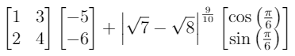
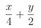

# TeX Math Parser

TeX Math Parser parses TeX math into [a MathJS expression tree](https://mathjs.org/docs/expressions/expression_trees.html) which can then be further manipulated and evaluated by [MathJS](https://mathjs.org/). The library also provides convenience functions for directly evaluating TeX math with MathJS.

This library works well as a bridge between [MathQuill](http://mathquill.com/) and MathJS. Use this library to parse the TeX formatted output from MathQuill into a format that can be manipulated by MathJS.

## TeX Features

* Common operators available in TeX math mode: `+`, `-`, `*`, `^`, `/`, `\cdot`
* Basic functions: `\sqrt`, `\frac`, `\sin`, `\cos`, `\tan`, `\csc`, `\sec`, `\cot`, `\arcsin`, `\arccos`, `\arctan`, `\log`, `\ln`
* Constants: `\pi`, `e`
* Environnements: `matrix`
* Variables

## Browser Support

Any browser with ES6 support.

## Installation

Install with NPM:

```
npm install tex-math-parser 
```

or link to it from a CDN:

```html
<script src=https://cdn.jsdelivr.net/npm/tex-math-parser></script>
```

## Usage

Given the following TeX source string:


```latex
\begin{bmatrix}1&3\\2&4\end{bmatrix}\begin{bmatrix}-5\\-6\end{bmatrix}+\left|\sqrt{7}-\sqrt{8}\right|^{\frac{9}{10}}\begin{bmatrix}\cos\left(\frac{\pi}{6}\right)\\\sin\left(\frac{\pi}{6}\right)\end{bmatrix}
```

Load the package and escape the string:

```javascript
import { parseTex, evaluateTex, evaluateTexFormatted } from 'tex-math-parser' // ES6 module

// Make sure to escape the string!
const escapedTex = String.raw`\begin{bmatrix}1&3\\2&4\end{bmatrix}\begin{bmatrix}-5\\-6\end{bmatrix}+\left|\sqrt{7}-\sqrt{8}\right|^{\frac{9}{10}}\begin{bmatrix}\cos\left(\frac{\pi}{6}\right)\\\sin\left(\frac{\pi}{6}\right)\end{bmatrix}`; // ES6 raw template string
```

Evaluate the string and get an answer in TeX:

```javascript
const texAnswer = evaluateTex(escapedTex); 
console.log(texAnswer); 
// \begin{bmatrix}-22.812481734548864\\-33.89173627896382\\\end{bmatrix}
```

Evaluate the string and get an answer formatted in a human readable format:

```javascript
const answer = evaluateTexFormatted(escapedTex);
console.log(answer); 
// [[-22.812481734548864], [-33.89173627896382]]
```


Parse the string and get a [a MathJS expression tree](https://mathjs.org/docs/expressions/expression_trees.html):
```javascript
const mathJSTree = parseTex(escapedTex);
```

### Variables
If the TeX string contains variables, the value of the variables must be supplied when evaluating.



```javascript
const texStr = String.raw`\frac{x}{4}+\frac{y}{2}`;
const answer = evaluateTexFormatted(texStr, {x: 2, y: 1});
console.log(answer); // 1
```

## API

`evaluateTex(texStr: string, scope: Object)`

Evaluate a TeX string, replacing any variable occurences with their values in `scope`. The answer is returned as a TeX string.

`evaluateTexFormatted(texStr: string, scope: Object)`

Same as `evaluateTex`, but the answer is returned as a human-readable formatted string.

`parseTex(texStr: string)`

Convert a TeX string into [a MathJS expression tree](https://mathjs.org/docs/expressions/expression_trees.html). The function returns the root node of the tree.


## Details

`parseTex` first lexes the TeX string into tokens, which are then passed to the parser to create the expression tree. A context-free grammar for the simplified version of TeX math used by the parser is as follows:

```
expr = term ((PLUS | MINUS) term)*

term = factor ((CDOT factor | primary )* // primary and factor must both not be NUMBERs

factor = MINUS? power

power = primary (CARET primary)*

primary = grouping
        | environnment
        | frac
        | function
        | NUMBER
        | VARIABLE

grouping = LEFT LPAREN expr RIGHT RPAREN
         | LPAREN expr RPAREN
         | LBRACE expr RBRACE
         | LEFT BAR expr RIGHT BAR
         | BAR expr BAR

environnment = matrix

frac = FRAC LBRACE expr RBRACE LBRACE expr RBRACE

function = (SQRT | SIN | COS | TAN ...) grouping

matrix = BEGIN LBRACE MATRIX RBRACE ((expr)(AMP | DBLBACKSLASH))* END LBRACE MATRIX RBRACE
```

As the grammar is not left-recursive, the parser was implemented as a recursive descent parser with each production being represented by a separate function. This keeps the parser easily extensible.

